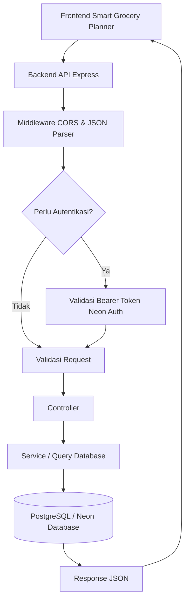

<h1 align="center">Smart Grocery Planner Backend API</h1>

Backend API untuk aplikasi Smart Grocery Planner. Project ini menyediakan layanan API untuk autentikasi berbasis Neon Auth, pengelolaan pengguna, rekomendasi meal plan, kalender meal plan, dan shopping cart atau daftar belanja.

API ini digunakan oleh frontend Smart Grocery Planner untuk mendukung fitur rekomendasi resep, pembuatan meal plan, penyimpanan jadwal makan, serta pembuatan daftar belanja berdasarkan kebutuhan pengguna.

## Daftar Isi

- [1. Deskripsi Singkat Proyek](#1-deskripsi-singkat-proyek)
- [2. Arsitektur Backend](#2-arsitektur-backend)
- [3. Fitur Utama](#3-fitur-utama)
- [4. Setup Environment](#4-setup-environment)
- [5. Cara Menjalankan Server](#5-cara-menjalankan-server)
- [6. Environment Variables](#6-environment-variables)
- [7. Database dan Migration](#7-database-dan-migration)
- [8. Struktur Proyek](#8-struktur-proyek)
- [9. API Endpoint](#9-api-endpoint)
- [10. Teknologi yang Digunakan](#10-teknologi-yang-digunakan)

## 1. Deskripsi Singkat Proyek

Project ini merupakan backend API yang dibangun menggunakan Node.js dan Express. Backend ini bertugas sebagai penghubung antara frontend, database PostgreSQL, dan layanan AI Grocery Planner.

Melalui API ini, aplikasi dapat mengelola data pengguna, membuat rekomendasi meal plan, menyimpan jadwal makan ke kalender, mengambil detail meal plan, memperbarui meal plan, menghapus meal plan, serta menghasilkan shopping cart berdasarkan meal plan pengguna.

Backend ini juga dilengkapi dengan middleware autentikasi, validasi request, error handling terpusat, dan migration database menggunakan node-pg-migrate.

## 2. Arsitektur Backend

Alur kerja umum backend:

1. Frontend mengirim request ke backend API.
2. Backend menerima request melalui Express router.
3. Request tertentu akan melewati middleware autentikasi menggunakan Bearer Token dari Neon Auth.
4. Request body, params, query, atau headers divalidasi menggunakan Joi.
5. Controller memproses request dan memanggil service atau database.
6. Database PostgreSQL digunakan untuk menyimpan data pengguna, meal plan, dan shopping cart.
7. Backend mengembalikan response JSON ke frontend.



## 3. Fitur Utama

Fitur utama backend API:

- Autentikasi request menggunakan token Neon Auth.
- Pengambilan data pengguna berdasarkan ID.
- Generate meal plan berdasarkan kebutuhan pengguna.
- Rekomendasi meal plan.
- Menyimpan meal plan ke kalender.
- Mengambil daftar meal plan dari kalender.
- Mengambil detail meal plan berdasarkan ID.
- Memperbarui meal plan.
- Menghapus meal plan tertentu.
- Menghapus meal plan untuk jadwal mendatang.
- Generate shopping cart berdasarkan meal plan.
- Mengambil daftar shopping cart.
- Toggle status item shopping cart.
- Validasi request menggunakan Joi.
- Error handling terpusat.
- Database migration menggunakan node-pg-migrate.

## 4. Setup Environment

Pastikan perangkat sudah memiliki:

- Node.js
- npm
- PostgreSQL database atau Neon Database

### Clone repository

```bash
git clone <URL_REPOSITORY> 
cd <NAMA_FOLDER_PROJECT>
```

### Instalasi dependencies
```bash
npm install
```

## 5. Cara Menjalankan Server

Jalankan server pada mode development menggunakan perintah berikut:

```bash
npm start
```

Untuk pengguna nodemon:
```text
 npm run start:dev 
```

Untuk menjalankan server pada mode production:
```bash
npm run start:prod
```

Jika konfigurasi menggunakan port default dari `.env.example`, server akan berjalan pada:

```bash
http://localhost:<PORT>
```

## 6. Environment Variables

Project ini menggunakan environment variables untuk konfigurasi server, database, dan autentikasi.

Buat file `.env` di root project, lalu isi konfigurasi berikut:

```env
DATABASE_URL=<DATABASE_URL>
NEON_AUTH_URL=https://ep-xxx.neonauth.us-east-2.aws.neon.build/neondb/auth
AI_SERVICE_URL=https://riezqidr-capstone-ai-dev.hf.space
HOST=localhost
PORT=3000
NODE_ENV=development
```

Keterangan:

- `DATABASE_URL`: URL koneksi PostgreSQL atau Neon Database.
- `NEON_AUTH_URL`: URL Neon Auth yang digunakan untuk validasi JWT melalui JWKS.
- `AI_SERVICE_URL`: URL endpoint AI service yang digunakan untuk proses pengolahan data.
- `HOST`: Host server, contoh `localhost`.
- `PORT`: Port yang digunakan server backend.
- `NODE_ENV`: Mode environment aplikasi, contoh `development` atau `production`.


Contoh file environment tersedia pada:
```text
.env.example
```

## 7. Database dan Migration

Project ini menggunakan PostgreSQL sebagai database dan `node-pg-migrate` untuk mengelola migration.

Migration yang tersedia mencakup pembuatan tabel dan custom type untuk kebutuhan:

- Users
- Scheduled meals
- Shopping cart items
- Shopping cart state
- Trigger sinkronisasi user
- Custom database types

Untuk menjalankan migration:
```bash
npm run migrate up
```

Untuk rollback migration terakhir:
```bash
npm run migrate down
```

Pastikan `DATABASE_URL` sudah dikonfigurasi dengan benar sebelum menjalankan migration.

## 8. Struktur Proyek

```text
migrations/ # File migration database
src/
    server.js # Entry point aplikasi
    server/ # Konfigurasi Express app, CORS, JSON parser, routes, dan error handler
    routes/ # Root router untuk menggabungkan semua route service
    middlewares/ # Middleware autentikasi, validasi, dan error handling
    security/ # Validasi token JWT dari Neon Auth
    errors/ # Custom error classes
    services/
        users/ # Service untuk data pengguna
        calender/ # Service untuk meal plan, calendar, dan rekomendasi
        shopping-cart/ # Service untuk shopping cart atau daftar belanja
    utils/ # Helper untuk response API
```


## 9. API Endpoint

### Users

| Method | Endpoint | Auth | Deskripsi |
| --- | --- | --- | --- |
| GET | `/users/:id` | Tidak | Mengambil data pengguna berdasarkan ID |

### Calendar / Meal Plan

| Method | Endpoint | Auth | Deskripsi |
| --- | --- |----| --- |
| GET | `/calendar` | Ya | Mengambil meal plan pengguna |
| GET | `/calendar/:id` | Ya | Mengambil detail meal plan berdasarkan ID |
| POST | `/calendar` | Ya | Menyimpan atau menerapkan meal plan ke kalender |
| PATCH | `/calendar` | Ya | Memperbarui meal plan |
| DELETE | `/calendar/future` | Ya | Menghapus meal plan untuk jadwal mendatang |
| DELETE | `/calendar/:id` | Ya | Menghapus meal plan berdasarkan ID |
| POST | `/calendar/generate` | Ya | Generate meal plan |
| POST | `/recommend` | Ya | Mendapatkan rekomendasi meal plan |

### Shopping Cart

| Method | Endpoint | Auth | Deskripsi |
| --- | --- | --- | --- |
| GET | `/shopping-cart` | Ya | Mengambil daftar shopping cart |
| POST | `/shopping-cart/generate` | Ya | Generate shopping cart berdasarkan meal plan |
| PATCH | `/shopping-cart/:id/toggle` | Ya | Mengubah status item shopping cart |

### Header Autentikasi

Endpoint yang membutuhkan autentikasi harus menyertakan header berikut:
```http request
 Authorization: Bearer <ACCESS_TOKEN>
```

Beberapa endpoint juga membutuhkan header timezone:
```http request
X-Timezone: Asia/Jakarta
```

## 10. Teknologi yang Digunakan

- Node.js
- Express
- PostgreSQL
- Neon Database
- Neon Auth